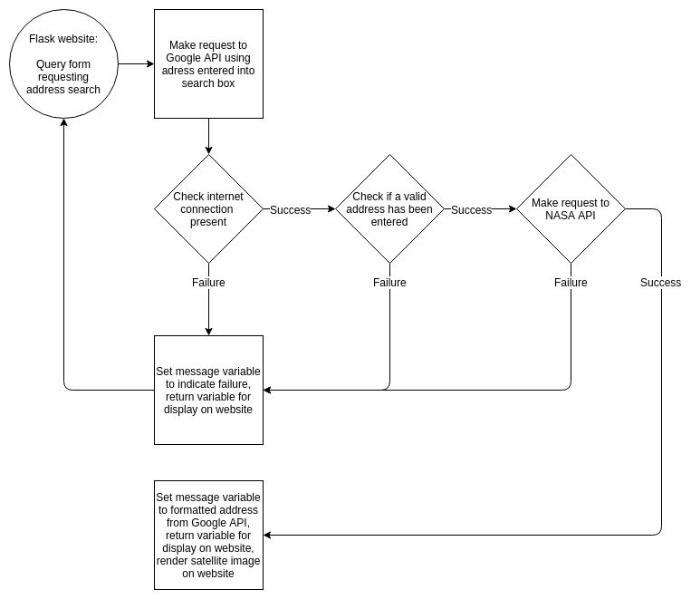

The application, geo2sat will be implemented using the Flask framework, and will present the user with a web page containing a search form, requesting that the user enter an address. There will be a flask route to take this address and send it to Google's Geocoding API, using an API key, to retrieve detailed information about the location entered. This response will be stored as a GEOCODE class instance which will contain all the received information, and contain methods to operate on the data retrieved so as to avoid continually hitting the API endpoint. There will be a method to check that the response received was OK, and to extract the formatted address returned to be displayed to the user, as well as extract the longitudinal and latitudinal information from the data returned. 

This longitudinal and latitudinal data will then be sent via NASA's Landsat 8 API, using another API key, to receive satellite imagery information. This response will be stored as a SATELLITE class instance which will contain a method to extract information containing the link to the satellite image for the entered address.

The flask website template will have a message variable to display a formatted address, or an error message, along with an image if one has been returned.

Error handling will consist of checking user input for either no input, or an address returned as invalid by the Google API, as well as checking for an active internet connection. There will also be a catch all for the NASA API request, to be displayed as an error message and request the user to try again.

This application has the following dependencies:

- Python 3
- python-dotenv == 0.10.3
- Flask == 1.1.1
- Requests == 2.21.0
- Yaml == Python 3 standard library
  - This has been removed in favour of loading API keys from .env file instead

**Notes**:

Source code at: https://github.com/scallensc/geo2sat

Application has been deployed on Heroku: https://agile-basin-40126.herokuapp.com/

I have also implemented CI/CD with CircleCI, which will pickup any changes made on GitHub, and will automatically push to Heroku to build after running flake8 linter on files, as well as Bandit which is a python security checker.

I had originally written an API_KEY class to retrieve keys from a .yaml file, I have since switched to using dotenv loading instead, I have however left the original code in, commented out, to show my idea there.

